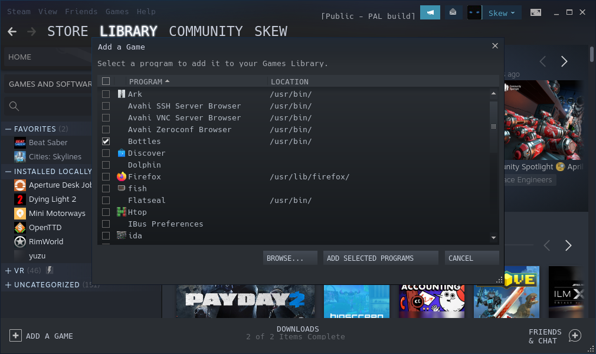

# Adding bottles to Steam
1. While in Desktop mode, open Steam by clicking on the Steam icon in your taskbar.
2. Select Library
3. Click on `ADD A GAME` in the bottom left
4. Click on the checkbox next to `Bottles` in the program list
5. Click on `ADD SELECTED PROGRAMS`

Now, when you go back to the Gaming mode, you should see the Bottles app in your library (last tab)
Make sure to change the in-steam settings to use the mouse & keyboard inputs.