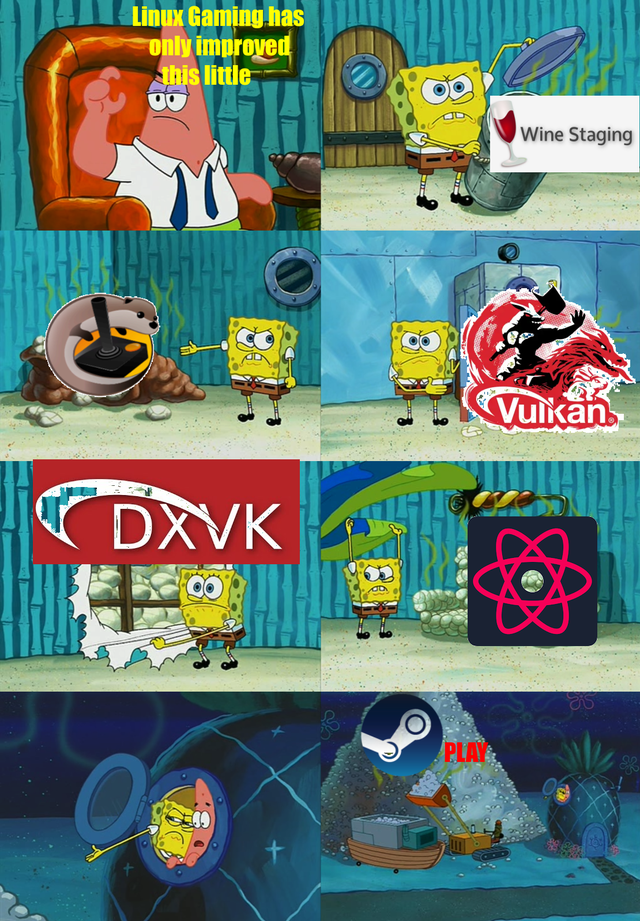

# How to run Windows aplications on Steam Deck
As you may know, whenever you try to run Windows game through Steam, you are using Proton (Valve's compatibility layer) that uses tons of trickery under the hood to trick the game into thinking it's running on Windows.  

You can use Proton outside of Steam, but there are still problems with it - mainly because it was made to run games, not applications, and most certainly not launchers that launch games. Each game often requires its own trickery to make it work.

All of these and more problems can be solved with: [Bottles!](./meet_bottles.md)

