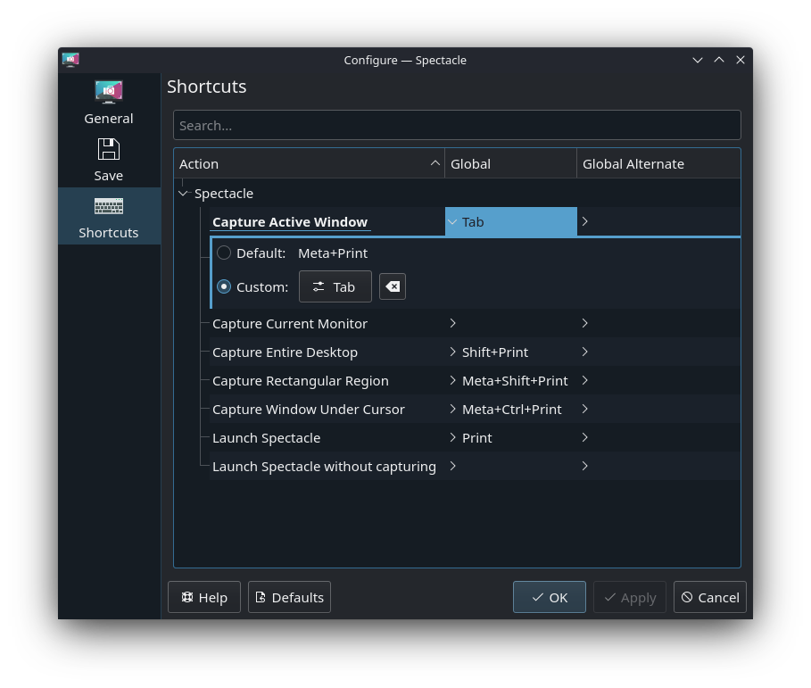

# 🖼️ Screenshots in Desktop mode

## Method 1
As you may or may not know, when you press and hold the `STEAM` or `three dot` button, some gamepad keys change their function:
- D-pad left becomes ESC
- D-pad down becomes Tab
- D-pad right becomes Enter

We will use this trick to create a shortcut to take screenshots:
1. Open Applications (bottom left corner) -> Utilities -> Spectacle (Screenshooting tool)
2. Click on Configure
3. Select Shortcuts menu
4. Click on a setting you wish to change shortcuts for (I use `Capture Active Window`)
5. Select `Custom` checkbox and click on the button next to it (Currently should say `None`)
6. Hold the `three dot` button on your steam deck and then press D-pad down.
7. Done! I also recommend checking `After taking a screenshot: Save file to default folder` in the `General` menu.

Note: Even though we have `Tab` key mapped to taking a screenshot, using the virtual steam keyboard appears to not trigger the screenshot  - which is ideal for us. Remember though, that pressing `Tab` on a real keyboard is going to take a screenshot 🧐

## Method 2
Spectacle, by default, takes a screenshot when opened. You can just pin it to the taskbar:
1. Open application launcher and head over to the Utilities section
2. Right-click (By pressing your left touchpad) on the Spectacle app
3. Select `Add to panel (Widget)`

By default it will be on the far left side of the taskbar. You can edit the taskbar by right-clicking it and selecting `Edit`. Then you should be able to drag things around.
