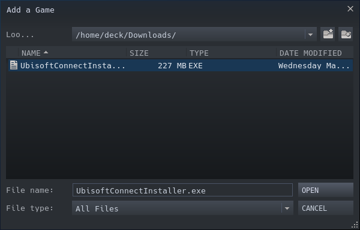
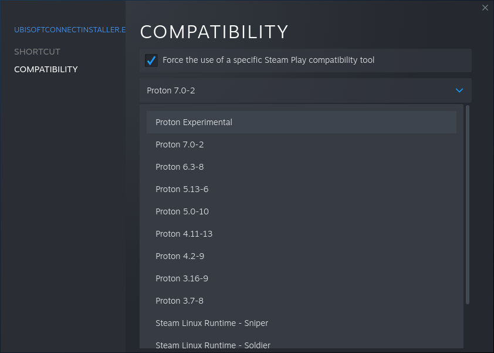
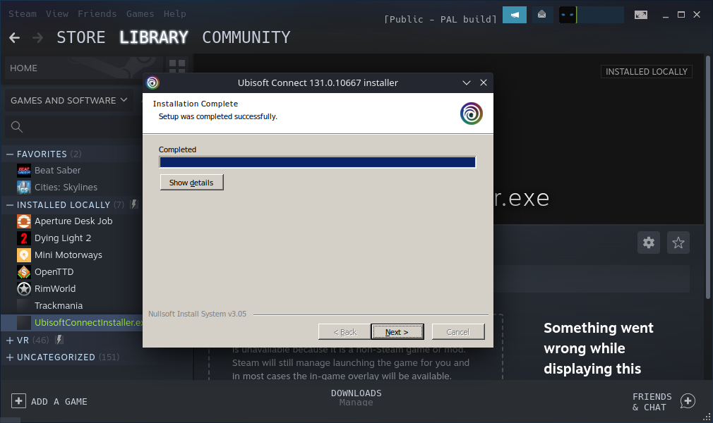
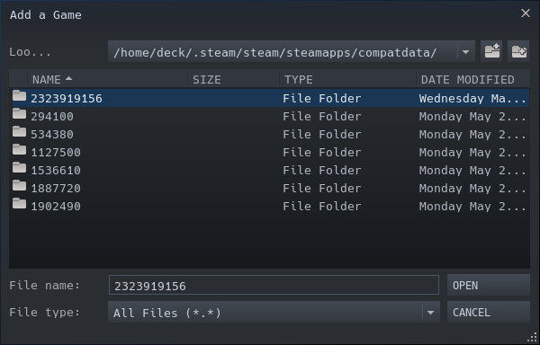
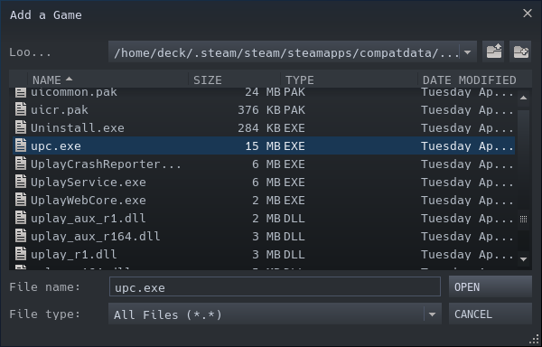

# 🧑‍💻 Non-steam launchers - Proton

If you prefer not to use Bottles, you can just run Windows apps with Proton, that is, built-in compatibility layer in Steam.
This is a little bit simpler, until you run into problems with different Proton versions.

This instruction will help you install Ubisoft Connect. But the process will be very similar for other launchers or games:

## Installing Ubisoft Connect
1. Go to Desktop mode
2. Open [Ubisoft Connect](https://ubisoftconnect.com/en-US/) in the browser, and hit the big blue button to download.
3. Make sure to check `Save File` instead of `Open with` when downloading with Firefox
4. Open Steam -> Library -> Add a non-steam game
5. Select just downloaded .exe by clicking on `Browse...`
    
6. In your Library, select just added installer and enter Properties
7. Head over to the Compatibility section, tick the Force box and select Proton 7 or Experimental.
    
8. Run the installer via Steam (Click Play) and install it just by clicking `Next`...
9. Do NOT start the application.
    

## Running Ubisoft Connect
1. Head back to your Steam Library, select the installer and enter Properties
2. Change the target path by clicking Browse
3. Go to `/home/deck/.steam/root/steamapps/compatdata/` (To see folders starting with a `.` you must enable it in the menu at the top right corner of the window)
4. Go to the directory that has a large number
    
5. Continue traversing the directories and select: `/pfx/drive_c/Program Files (x86)/Ubisoft/Ubisoft Game Launcher/upc.exe`
    
6. Done. You can optionally rename the steam entry from "UbisoftConnectInstaller.exe" to "Ubisoft Connect"

### SDcard Support
Add this to the launch options:
```
STEAM_COMPAT_MOUNTS=/run/media/mmcblk0p1/ %command%
```

### Adding games separately to Steam
You can add each game .exe file in Steam. The problem with that is that Steam will create a new compatdata directory for each game, and that compatdata directory would not have Ubisoft Connect installed.  
This can be fixed by adding this to the launch options:
```
STEAM_COMPAT_DATA_PATH="/home/deck/.local/share/Steam/steamapps/compatdata/LARGE_NUMBER" %command%
```
Make sure to change LARGE_NUMBER to a prefix number belonging to the Ubisoft Connect.