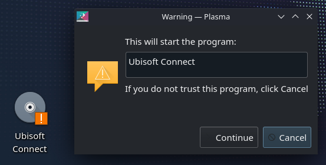
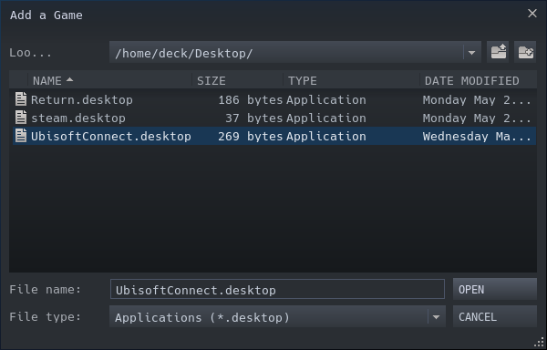

# Adding bottle to Steam

We are going to create a file, that will automagically execute a program in your Bottle. 
1. If you don't have it yet, install `KWrite` text editor.
2. Create a new file on the desktop called `Something.desktop` (Right click -> New -> Text file.) 

Paste in this content:
```properties
[Desktop Entry]
Name=Ubisoft Connect
Comment=Runs Ubisoft Connect launcher
Exec=flatpak run --command=bottles-cli com.usebottles.bottles run -b BOTTLE_NAME -p PROGRAM_NAME
Icon=input-gaming
Terminal=false
Type=Application
Categories=Game;
```

Replace `BOTTLE_NAME` with your bottle name (If you used spaces, use "")  
Replace `PROGRAM_NAME` with a program that you want to run.  

In my case the Exec line looks like this:
```properties
Exec=flatpak run --command=bottles-cli com.usebottles.bottles run -b Ubisoft -p "Ubisoft Connect"
```

Now you can just click the file on the desktop and your application should start within a few seconds.

When run for the first time, you would see a window with a warning, just click continue:


## Adding it to steam
This is very similar to a previous chapter, when we were adding Bottles app to steam. 
The only difference is, when you have the `Add a Game` window open, click `Browse` button and select just created `Something.desktop` file. 

The window looks like this:

