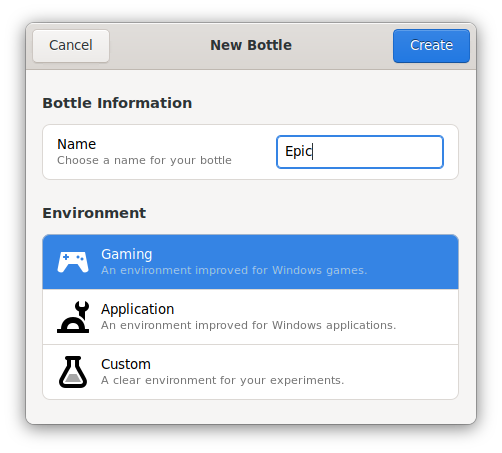
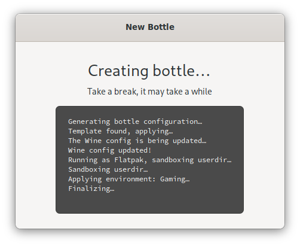
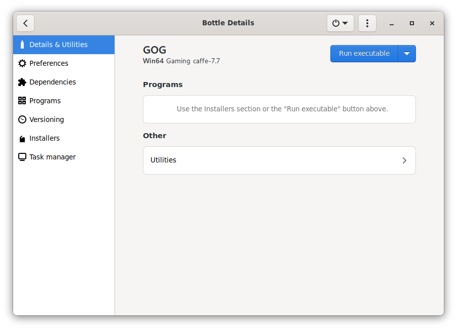
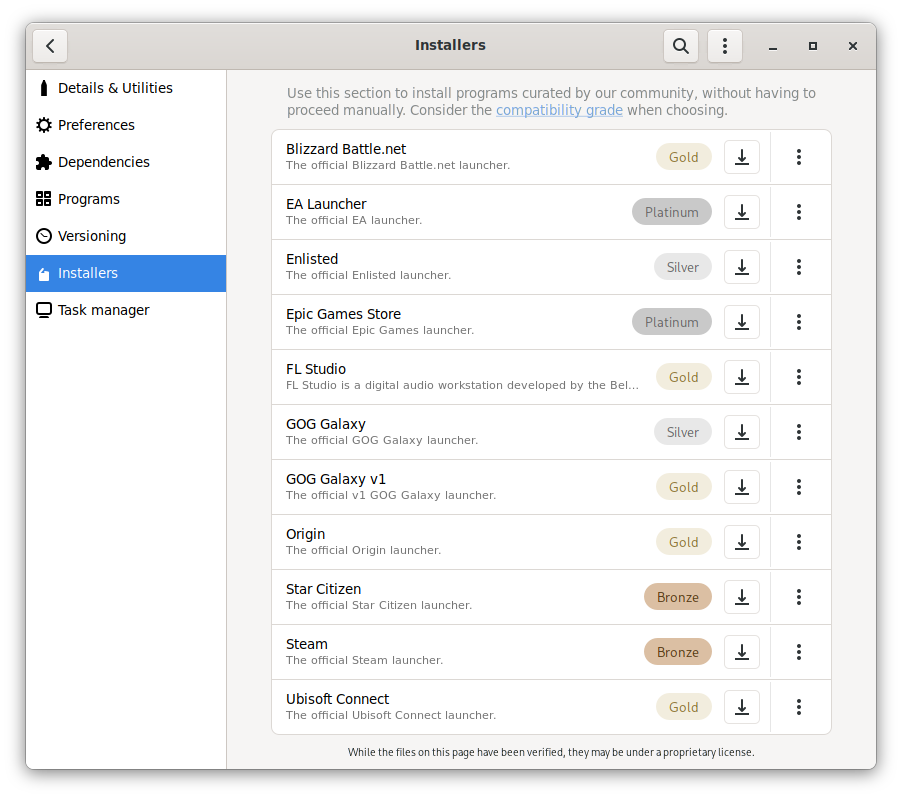

# Creating a Bottle
1. Create a new bottle by clicking the `+` in the top left corner
2. Pick a name for your bottle. You can create a separate bottle for every use-case, launcher, or even a game.
3. Select the environment, this will be: Gaming
4. Click on the Create button in the top right corner
5. This should take about 15 seconds

# Installing a launcher
Now you have a fresh "installation" of windows. You can view your "Drive C" by going to `/home/deck/.var/app/com.usebottles.bottles/data/bottles/bottles/BOTTLE_NAME/drive_c`.

You can run applications "in" this bottle, by clicking on it in the Bottles app, and pressing big blue button "Run executable".

But we are here to play non steam games with other launchers. Let's do it:
1. Select your just created bottle from the main screen in the Bottles app
2. On the menu on the left select "Installers"
3. Click on the download button next to a launcher you want to install.
4. Wait for it to complete (Depending on the installer, this can take a few minutes)
5. Done! You can run your launcher by going to "Details & Utilities" and pressing play button next to your launcher.
